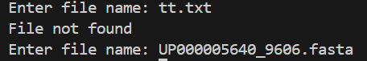

# Relative abundance of nucleotides and amino acids

## A simple project that calulates the relative abundance of Nucleotides and Amino acids.

### Overview

This simple project focuses on a simple workflow to parse a FASTA file using bash and Python and compute the relative abundance of nucleotides or amino acids in a given sequence.

It is used for
* nucleotide sequence analysis
* Protein sequence analysis
* To visualise residue frequency distributions

### Features

* Parses FASTA or any other type of files via Python.
* Counts the number of the occurance of each nucleotide/ amino acid in the file.
* Calculates the relative frequencies for each nucleotide/ amino acid in the sequence of iterest.
* Generates a relative abundance bar graph using `matplotlib`.
* Outputs a relative density graph sorted in alphabetical order of the nucleotide/ amino acids.

### Requirements

* Python 3
* Linux like terminal to run bash codes
* `matplotlib` library
* `os` module

Install libraries:
``` bash
pip install matplotlib
```

### Usage

#### Preparing FASTA files

Using linux like terminal:

1. Download the FASTA file.

``` bash
wget ftp://ftp.expasy.org/databases/uniprot/current_release/knowledgebase/reference_proteomes/Eukaryota/UP000005640/UP000005640_9606.fasta.gz
```

2. Unzip the FASTA file if it is compressed.

``` bash
gunzip UP000005640_9606.fasta.gz
```
Note: Make sure to set the working directory the same as the directory `parser.py` file is stored.

#### For other file types

The other file types can be directly stored in the working directory that `parser.py` file is stored.

#### Running the code

Open `parser.py` Python file in any IDE of preference. Then run the code. (Note: `parser.py` and the downloaded files must be in the same working directory, else it will raise an error -> ```FileNotFoundError```)

The code starts by importing the `matplotlib.pyplot` module which is going to help us to visualise the relative abundances of the amino acids. It is imported as plt for easy use.

```python
import matplotlib.pyplot as plt
```
Then `os` module is imported which will help us to check whether our files are in the directory, later in the code.

```python
import os
```
The main program runs first by assigning the file name to the variable `file_name` via a while loop. The user is allowed to enter the file name. The program provides a warning if the file is not found and allows the user to re enter the correct file name. This continues as a loop until the user enters the correct file name.
 
 ```python
while True:
    file_name = input('Enter the file name: ')
    if os.path.isfile(file_name):
        break  
    else:
        print('File not found')
```
Example:



 Then the file is opened and each line in the file is read. 

 ```python 
 my_file = open(file_name).readlines()
 ```

 Once done, the function `statistics` is applied where the input parameter is our file with the variable `file_name`. 
 
```python
stats = statistics(my_file)
```
This function identifies each line starting with a ">" , ignores that line and computes the number of unique elements in the lines other than lines that start with ">". It iterates through a for loop where for each character it checks whether the character is in the dictionary named stats. If the character is not in it, it creates a key:value pair in the dictionary where the key represents the unique element and the value represents the occurance of that element. When a new key:value pair is added, the value is zero and increments to 1 considering it as a count. If the element already exists in the dictionary, we increment the count. The function returns this key:value count as a dictionary.

```python
def statistics(file_name) -> dict:
    '''Returns the abundances of the elements in the sequences'''
    
    stats = {}
    for line in file_name:
        if ">" not in line:
            for char in line.strip("\n"):
                if char not in stats:
                    stats[char] = 0
                stats [char] += 1
    return stats
```

Then the function `graphical_statistics` is applied. The input variable is the dictionary with abundances that was returned from the previous function. These are stored in the variable `stats`. 

```python
rf = graphical_statistics(stats)
```

The function `graphical_statistics` computes the relative abundances using the results we obtained from the previous function and displays the results as a bar graph. First, it obtains the abundances from the `statistics` function and calculates the relative abundance iteratively. These values are stored as a key value pair in the dictionary rf where the keys are the amino acids or nucleotides and the values are their relative abundances. Then the bar graph is plotted using `matplotlib.pyplot`. 

The x-axis represents the nucleotides/ amino acids and the y-axis represents the relarive frequencies. Here, an option is provided to enter the title for the bar graph based on the users needs.

``` python
def graphical_statistics(my_data:dict):
     ''' Returns relative abundances as a bar graph'''

    rf = {}
    total = sum(my_data.values())
    for k in my_data:
        rf[k] = my_data[k]/total
    sorted_rf = dict(sorted(rf.items()))
    
    x = [k for k in sorted_rf]
    y = [v for v in sorted_rf.values()]
    
    plt.title(input('Enter the title: ))
    plt.bar(x,y)
    return plt.show()
```
Example: 


### Results
Results are shown after executing the following code.

``` python
print(rf)
```

The program returns a bar graph with the relative abundances of nucleotides or amino acids based on the type of file provided.

![Results]](results.png)

### Conclusions

Using this simple program we can get a look at the statistics of any file provided with a sequence.